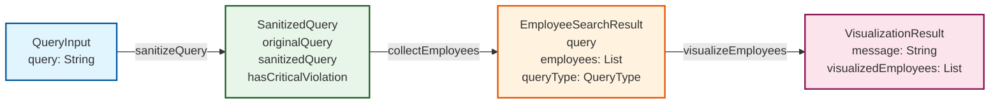
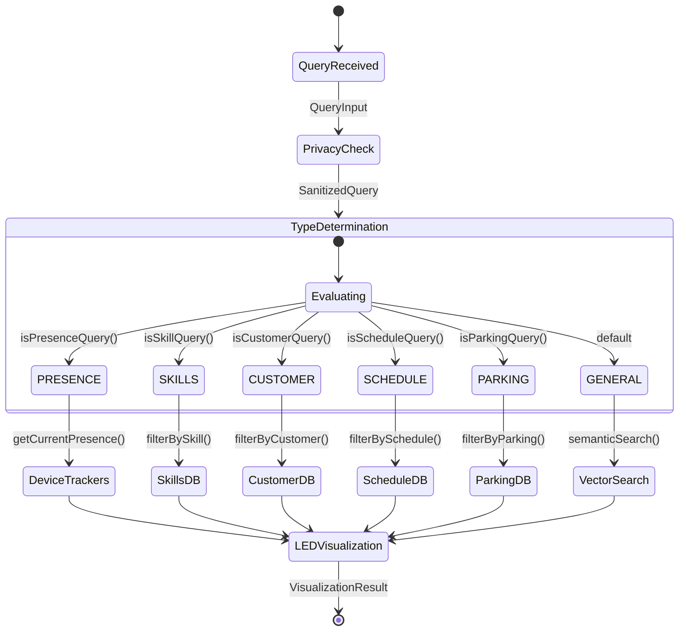
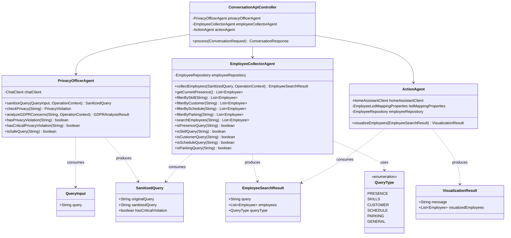
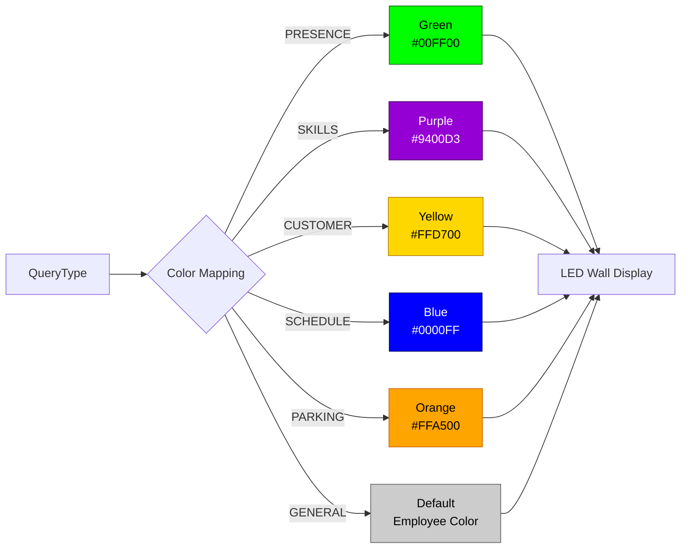
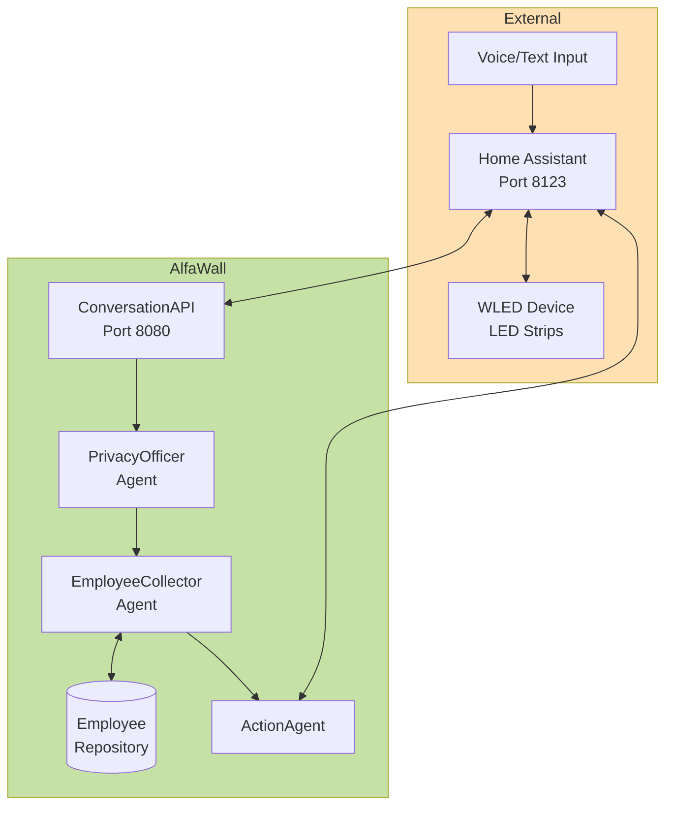

# OODA Loop Flow - AlfaWall Agent Architecture

## Overview
The AlfaWall system uses a manual OODA (Observe-Orient-Decide-Act) loop implementation with type-based action chaining between three specialized agents.

## Main Sequence Flow

```sequence
Title: OODA Loop - Employee Presence Query Flow

User->Home Assistant: "Is John present?"
Home Assistant->ConversationAPI: POST /api/conversation/process
Note right of ConversationAPI: OBSERVE Phase
ConversationAPI->PrivacyOfficer: sanitizeQuery(QueryInput)
PrivacyOfficer->PrivacyOfficer: Check PII/GDPR\n(8 regex patterns)
PrivacyOfficer-->ConversationAPI: SanitizedQuery

Note right of ConversationAPI: ORIENT Phase
ConversationAPI->EmployeeCollector: collectEmployees(SanitizedQuery)
EmployeeCollector->EmployeeCollector: Determine QueryType\n(PRESENCE/SKILLS/etc)
EmployeeCollector->EmployeeRepository: Get matching employees
EmployeeRepository->HomeAssistantClient: Check device trackers
HomeAssistantClient-->EmployeeRepository: Presence data
EmployeeRepository-->EmployeeCollector: Employee list
EmployeeCollector-->ConversationAPI: EmployeeSearchResult

Note right of ConversationAPI: DECIDE & ACT Phase
ConversationAPI->ActionAgent: visualizeEmployees(result)
ActionAgent->ActionAgent: Determine LED color\nby QueryType
ActionAgent->HomeAssistantClient: Turn ON matched LEDs
ActionAgent->HomeAssistantClient: Turn OFF unmatched LEDs
HomeAssistantClient->WLED: Control LED segments
WLED-->HomeAssistantClient: OK
ActionAgent-->ConversationAPI: VisualizationResult

ConversationAPI-->Home Assistant: ConversationResponse
Home Assistant-->User: "X employees visualized"
```

## Query Type Routing Flow

```flow
st=>start: User Query
determine=>operation: EmployeeCollectorAgent
Determine Query Type
presence=>condition: isPresenceQuery?
skills=>condition: isSkillQuery?
customer=>condition: isCustomerQuery?
schedule=>condition: isScheduleQuery?
parking=>condition: isParkingQuery?

presence_op=>operation: getCurrentPresence()
Device Trackers
skills_op=>operation: filterBySkill()
Skills Database
customer_op=>operation: filterByCustomer()
Assignments
schedule_op=>operation: filterBySchedule()
Office Calendar
parking_op=>operation: filterByParking()
Parking Calendar
general_op=>operation: semanticSearch()
Vector Search

led_green=>operation: LED Green #00FF00
led_purple=>operation: LED Purple #9400D3
led_yellow=>operation: LED Yellow #FFD700
led_blue=>operation: LED Blue #0000FF
led_orange=>operation: LED Orange #FFA500
led_default=>operation: LED Default Color

e=>end: Visualization Result

st->determine
determine->presence
presence(yes)->presence_op->led_green->e
presence(no)->skills
skills(yes)->skills_op->led_purple->e
skills(no)->customer
customer(yes)->customer_op->led_yellow->e
customer(no)->schedule
schedule(yes)->schedule_op->led_blue->e
schedule(no)->parking
parking(yes)->parking_op->led_orange->e
parking(no)->general_op->led_default->e
```

## Domain Objects Type Chain



## Three-Agent Architecture

```mermaid
graph TB
    subgraph OBSERVE["🔍 OBSERVE Phase - PrivacyOfficerAgent"]
        PO[PrivacyOfficerAgent]
        PO --> PII[8 PII Regex Patterns]
        PO --> GDPR[LLM GDPR Analysis]

        PII --> EMAIL[EMAIL]
        PII --> PHONE[PHONE]
        PII --> CC[CREDIT_CARD]
        PII --> SSN[SSN/BSN]
        PII --> IP[IP_ADDRESS]
        PII --> ADDR[PHYSICAL_ADDRESS]
        PII --> POST[POSTCODE]
        PII --> SENS[SENSITIVE_DATA]
    end

    subgraph ORIENT["🧭 ORIENT Phase - EmployeeCollectorAgent"]
        EC[EmployeeCollectorAgent]
        EC --> Cond[@Condition Methods]
        EC --> Tools[@Tool Methods]

        Cond --> C1[isPresenceQuery]
        Cond --> C2[isSkillQuery]
        Cond --> C3[isCustomerQuery]
        Cond --> C4[isScheduleQuery]
        Cond --> C5[isParkingQuery]

        Tools --> T1[getCurrentPresence]
        Tools --> T2[filterBySkill]
        Tools --> T3[filterByCustomer]
        Tools --> T4[filterBySchedule]
        Tools --> T5[filterByParking]
        Tools --> T6[semanticSearch]
    end

    subgraph ACT["⚡ DECIDE & ACT Phase - ActionAgent"]
        AA[ActionAgent]
        AA --> Color[Context-Based Colors]
        AA --> LED[LED Control]

        Color --> GREEN[PRESENCE → Green]
        Color --> PURPLE[SKILLS → Purple]
        Color --> YELLOW[CUSTOMER → Yellow]
        Color --> BLUE[SCHEDULE → Blue]
        Color --> ORANGE[PARKING → Orange]

        LED --> ON[Turn ON Matched]
        LED --> OFF[Turn OFF Unmatched]
    end

    PO -->|SanitizedQuery| EC
    EC -->|EmployeeSearchResult| AA

    style OBSERVE fill:#e3f2fd,stroke:#1565c0,stroke-width:3px
    style ORIENT fill:#e8f5e9,stroke:#2e7d32,stroke-width:3px
    style ACT fill:#fff3e0,stroke:#ef6c00,stroke-width:3px
    style PO fill:#bbdefb
    style EC fill:#c8e6c9
    style AA fill:#ffccbc
```

## Query Type State Machine



## Agent Interaction Class Diagram



## LED Color Mapping



## Performance Timeline

```mermaid
gantt
    title OODA Loop Execution Timeline (< 1 second total)
    dateFormat SSS
    axisFormat %L ms

    section OBSERVE
    Privacy Check (Regex)           :a1, 000, 50ms
    Optional GDPR Analysis (LLM)    :a2, 050, 150ms

    section ORIENT
    Query Classification            :b1, 200, 50ms
    Data Retrieval                  :b2, 250, 300ms

    section DECIDE & ACT
    Color Determination             :c1, 550, 50ms
    LED Control (Parallel)          :c2, 600, 350ms

    section Response
    Build Response                  :d1, 950, 50ms
```



## Key Design Patterns

### 1. Type-Based Action Chaining
Each agent's `@Action` method produces a strongly-typed output that becomes the input for the next agent's `@Action` method. This enables:
- Compile-time type safety
- Clear data flow contracts
- Future automatic GOAP planning

### 2. Query Type Enumeration
```java
public enum QueryType {
    PRESENCE,  // Real-time device tracking → Green LEDs
    SKILLS,    // Employee expertise search → Purple LEDs
    CUSTOMER,  // Customer/project assignments → Yellow LEDs
    SCHEDULE,  // Office calendar queries → Blue LEDs
    PARKING,   // Parking spot allocation → Orange LEDs
    GENERAL    // Semantic/fallback search → Default colors
}
```

### 3. Condition-Based Routing
The `EmployeeCollectorAgent` uses `@Condition` annotated methods to classify queries:
```java
@Condition
public boolean isPresenceQuery(String query) {
    return query.toLowerCase().contains("here") ||
           query.toLowerCase().contains("present") ||
           query.toLowerCase().contains("in the office");
}
```

### 4. Reactive LED Control
LED operations use Project Reactor's reactive streams for parallel, non-blocking execution:
```java
Flux.concat(
    turnOnLedsForEmployees(matchedEmployees, contextColor),
    turnOffLedsForEmployees(unmatchedEmployees)
).then().block();
```

## Embabel Agent Framework Annotations

| Annotation | Purpose | Used In |
|------------|---------|---------|
| `@Agent` | Defines an agent (includes `@Component`) | All 3 agents |
| `@Action` | Marks a GOAP action method | All action methods |
| `@AchievesGoal` | Marks goal-achieving action | ActionAgent.visualizeEmployees() |
| `@Export` | Makes action available for GOAP planning | ActionAgent.visualizeEmployees() |
| `@Condition` | Provides boolean checks for planning | EmployeeCollectorAgent query checks |
| `@Tool` | Exposes method to LLM for function calling | EmployeeCollectorAgent data methods |

## Performance Characteristics

- **Total Execution Time**: < 1 second end-to-end
- **Privacy Check**: 50ms (regex) + 150ms (optional LLM)
- **Query Classification**: O(1) condition evaluation (~50ms)
- **Data Retrieval**: 100-300ms (depends on query type)
- **LED Control**: 300-400ms (parallel WebFlux streams)

## Integration Points



## Future Enhancements

- [ ] Replace manual OODA loop with automatic GOAP planning
- [ ] Add cross-agent planning for complex multi-goal queries
- [ ] Implement `@Condition`-based action preconditions
- [ ] Add LLM-driven query decomposition for compound questions
- [ ] Enable dynamic goal specification via `@Goal` annotations
- [ ] Add metrics and observability (Prometheus/Grafana)
- [ ] Implement caching layer for frequently accessed data
- [ ] Add WebSocket support for real-time LED updates
